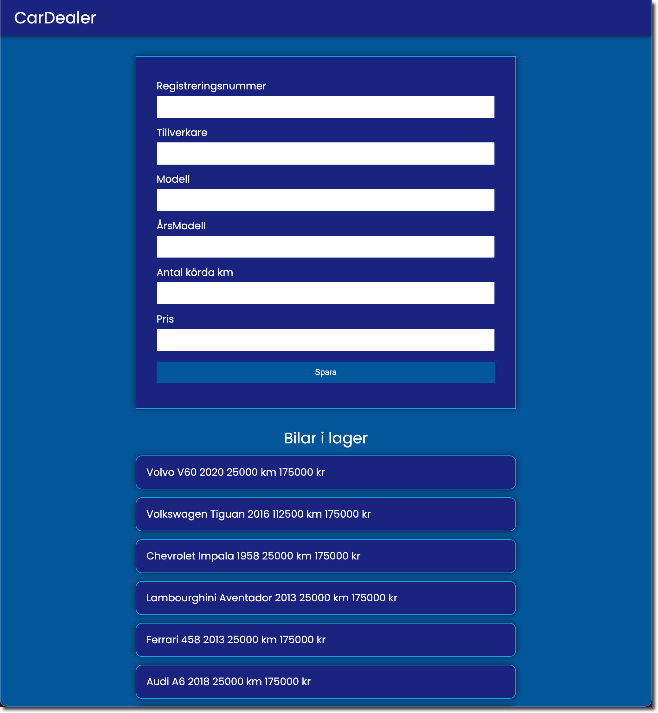

# CarDealer App

Jag har skapat ett exempel där jag gått lite "bananas" vad det gäller att skapa komponenter av olika slag.

Applikationen består av 2 delar. En klient del och en server/backend del.

#### Köra applikationen

I api katalogen kör kommandot **npm install**.
I client katalogen kör kommandot **npm install**.

Starta sedan upp api applikationen med **npm run dev**.
Efter det kör kommandot **npm run dev** i client katalogen.

### Klienten (client)

Under katalogen **src/components/ui** hittar ni alla komponenter som jag skapat för att generera utseendet.
En del komponenter är enkla komponenter som endast tar in props.children och eller text som ska visas.
Någon är mer avancerad som t ex Form.tsx som fungerar som en _generic_ komponent.

Syftet är att visa att styrkan med TypeScript är att vi kan skapa mycket avancerade React komponent som är återanvändbara i våra applikationer.

Jag har medvetet lagt all css i en fil, **src/assets/css/site.css** för att göra det så enkelt som möjligt att hitta formatteringen av komponenterna.
I en produktionsfärdig applikation bör detta göras om till css moduler.

Jag har även skapat en generell http hantering i katalogen **src/utilities/**

Här hittar ni

- httpClient.ts (innehåller två _generic_ funktioner för att hämta men också för att lägga till bilar).
- IResponseBaseType.ts (innehåller bastypen för returvärde ifrån REST API'et).
- IVehicleResponseType.ts (innehåller en utökning av IResponseBaseType för specifik retur hantering av bilar).

All kod för startsidan är placerad i **/src/pages/home.tsx**.

För att starta upp klienten så kör vi kommandot:
`npm run dev`

### Server (REST API)

I katalogen api hittar ni koden för REST API applikationen.
Här har jag använt mig av Node.js och design mönstret MVC.
För datahantering har jag använt **json-server** som är ett fake-api som vi kan använda för att hämta, lägga till, ta bort och uppdatera data.
Dessutom har jag installerat ett npm paket som heter **concurrently** som tillåter oss att köra igång flera kommandon samtidigt.

Så när vi startar servern med kommandot
`npm run dev`,
så startar både json-server och vårt REST API.
